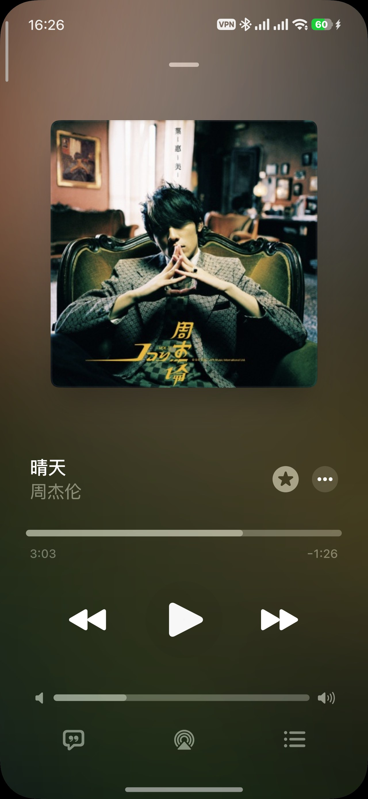
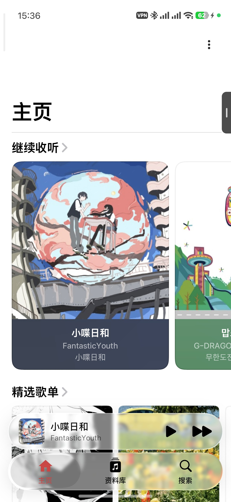
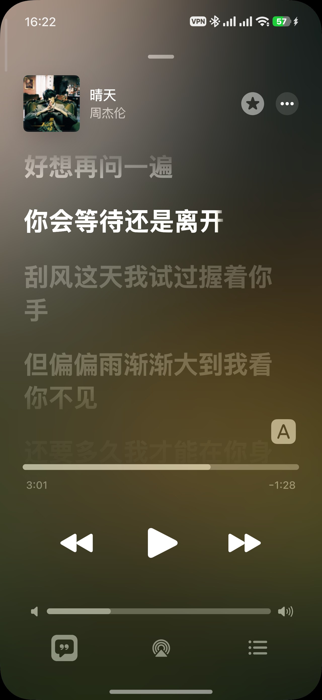
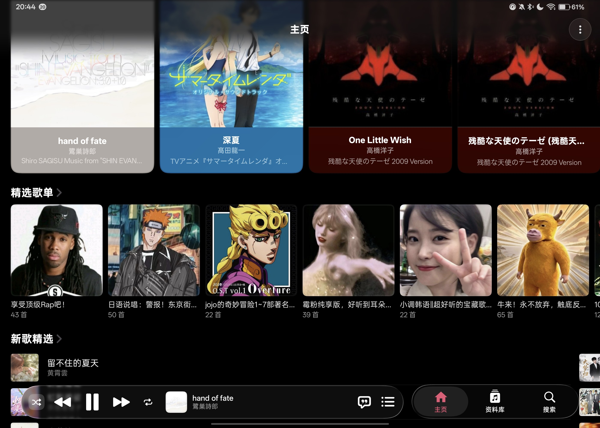

# Sonify

<p align="center">
  
</p>

**Sonify** 是一款 Android 音乐播放器：液态玻璃质感的 Compose 界面 + Media3 播放内核，
支持酷狗在线曲库与本地资料库，深度适配手机与平板两种形态。


## ✨ 特性

- **🌊 液态玻璃 UI** — 基于自研 backdrop 采样/模糊管线，迷你播放条、全屏播放页与底部导航都是实时磨砂玻璃质感，封面色彩随歌曲流动。
- **🎧 在线曲库** — 酷狗音源搜索、精选歌单与每日推荐；支持手机号验证码登录。
- **🎚 多音质切换** — 标准到超高音质自由切换，切换过程带探测与失败自动回退，不中断播放。
- **📝 歌词** — 逐行高亮歌词与翻译，支持状态栏歌词（Hook 方案）。
- **🎛 完整播放功能** — 倍速播放、睡眠定时器、播放队列拖拽编辑、最近播放。
- **📱 手机 / 平板双形态** — 平板横屏分栏布局，一台设备两种体验。
- **🔮 后台播放** — 基于 Media3 / MediaSession，后台稳定播放，通知栏与蓝牙耳机线控齐全。

## 📷 截图

| 主页 | 播放页 | 歌词 |
|---|---|---|
|  |  |  |

<table>
  <tr>
    <td width="100%"></td>
  </tr>
  <tr>
    <td align="center"><sub>平板横屏分栏</sub></td>
  </tr>
</table>

## ⬇️ 下载

前往 [**Releases**](https://github.com/XiaoZhi0729/Sonify/releases) 页面下载最新 APK 安装包。

> 当前发布版本：**v0.1.0（测试版）** —— 项目仍处于早期测试阶段，功能与稳定性都在持续打磨，遇到问题欢迎提 [Issue](https://github.com/XiaoZhi0729/Sonify/issues) 反馈。

> 需要 Android 6.0（API 23）及以上。小米/Redmi（HyperOS）设备建议在「省电策略」中设为无限制并允许自启动，否则息屏后播放可能被冻结。

## 🙏 致谢

本项目是以下两个开源项目的「缝合」产物，在此向两位上游作者致谢：

| 项目 | 说明 |
|---|---|
| [MD3 Music](https://github.com/zzyoxml/md3Music) | 基于 Material Design 3 的本地音乐播放器，本项目在线播放能力的上游 |
| [Flamingo (FlamingoSank)](https://github.com/Yos-X/FlamingoSank) | 本项目的上游基底 |

同时感谢以下开源库：

[Jetpack Compose](https://developer.android.com/jetpack/compose) ·
[Media3 / ExoPlayer](https://github.com/androidx/media3) ·
[Coil](https://github.com/coil-kt/coil) ·
[Accompanist](https://github.com/google/accompanist) ·
[Backdrop](https://github.com/Kyant0/backdrop)（液态玻璃背景模糊） ·
[Haze](https://github.com/chrisbanes/haze)（模糊玻璃材质） ·
[Cupertino](https://github.com/alexzhirkevich/cupertino) ·
[ComposeDataSaver](https://github.com/FunnySaltyFish/ComposeDataSaver) ·
[AndroidUtilCode](https://github.com/Blankj/AndroidUtilCode) ·
[MMKV](https://github.com/Tencent/MMKV) ·
[OkHttp](https://github.com/square/okhttp) ·
[Gson](https://github.com/google/gson) ·
[TinyPinyin](https://github.com/promeG/TinyPinyin) ·
[TagLib](https://github.com/Kyant0/taglib) ·
[Lyric Getter API](https://github.com/xiaowine/Lyric-Getter-Api)

## 🛠 构建与测试

仓库自带 Gradle wrapper（Gradle 9.3.1），需要 **JDK 17+** 与
Android Studio（SDK 37）。Windows PowerShell 下把 `./gradlew` 换成 `.\gradlew.bat`，
多命令用 `;` 分隔而非 `&&`。

```powershell
# 运行全部 JVM 单元测试（app 与 overscroll_core 两个模块）
./gradlew test

# 只跑 app 模块的 debug 单元测试
./gradlew :app:testDebugUnitTest

# 组装调试包（产物在 app/build/outputs/apk/debug/）
./gradlew assembleDebug
```

单元测试位于 `app/src/test/java/yos/music/player/`，以数据层与纯逻辑为主
（音质解析链、歌词加载、导航、UI 几何等），可完全在 JVM 上运行，无需连接设备。

说明：`release` 构建类型已启用混淆与资源收缩（`minifyEnabled`/`shrinkResources`），
但仓库不包含签名配置；签名与发布流程属于本地发布环节。

## 🧩 架构速览

单 Activity 架构，UI 全部使用 Jetpack Compose，播放内核基于 AndroidX Media3。

- 应用模块 `:app`，`applicationId` 为 `com.sonify.music`；另有回弹滚动库 `:overscroll_core`
- Gradle 根工程名 `Flamingo` 为历史遗留内部标识，与对外名称 Sonify 不冲突

| 职责 | 入口 | 位置（`app/src/main/java/yos/music/player/` 下） |
|---|---|---|
| 媒体控制（播放/队列/音质切换的单一事实源） | `object MediaController` | `code/MediaController.kt` |
| 在线曲库仓库 | `object KugouRepository` | `data/repositories/KugouRepository.kt` |
| 音质切换策略（纯函数，表格驱动 JVM 单测覆盖） | `object QualitySwitchPolicy` | `data/repositories/QualitySwitchPolicy.kt` |
| 主要 UI 页面 | `Home`、`NowPlaying` 及 discovery / library / search / settings 子目录 | `ui/pages/` |

欢迎 Issue 与 PR。提交前请先运行 `./gradlew test` 确认单测通过。

## ⚖️ License 与免责声明

本项目基于 [GPL-3.0](LICENSE) 协议开源。

本项目与酷狗官方无任何关联；在线音源能力基于公开接口实现，仅供学习与技术交流使用，
请支持正版音乐。使用本项目产生的任何问题由使用者自行承担。
